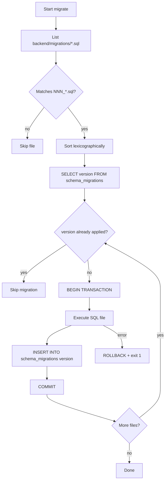

# Migration System

Политика SQL-миграций для AI Interviewer Platform.

**Подход:** raw SQL files + `MigrationRunnerService` + таблица `schema_migrations`  
**Реализация runner:** блок `01-✅-backend-foundation` (код не меняется в блоке 02)  
**Design docs:** этот файл + `docs/database/schemas/*.md` + `IMPLEMENTATION_PLAN.md`

Связанные документы:

- [`CONVENTIONS.md`](CONVENTIONS.md) — naming tables/columns/indexes/FK
- [`schema_migrations.bootstrap.sql.example`](schema_migrations.bootstrap.sql.example) — reference DDL bootstrap table

---

## Принципы

1. **SQL-first** — каждое изменение схемы = новый `.sql` file в git.
2. **Explicit DDL** — PK, FK, indexes в SQL, не через ORM.
3. **Forward-only (MVP)** — только UP migrations; автоматический rollback не поддерживается.
4. **One logical change set per file** — одна migration = одна reviewable единица.
5. **Ordered by filename** — порядок применения определяется префиксом номера в имени файла.
6. **Tracked in DB** — applied migrations записываются в `schema_migrations`.
7. **Design before code** — business migration создаётся только после design doc из блока 02.

### Запрещено

- Prisma migrations / `prisma db push`.
- TypeORM `synchronize: true` / auto-generated schema.
- Ручное изменение схемы в production без migration file.
- Редактирование уже применённых migration files на production (только новый файл).
- Создание business tables в feature-блоке без design doc.

---

## Расположение файлов

```txt
backend/
  migrations/
    001_create_schema_migrations.sql   ← уже существует (блок 01)
    002_create_users_and_companies.sql ← будущие feature-блоки
    ...
  src/
    migrate/
      main.ts
      migration-runner.service.ts
```

Design reference (не deploy):

```txt
docs/database/
  MIGRATIONS.md
  schema_migrations.bootstrap.sql.example
```

---

## Именование migration files

### Формат (как реализовано в runner)

```txt
NNN_description.sql
```

| Часть | Правило | Пример |
|-------|---------|--------|
| `NNN` | Трёхзначный zero-padded номер | `001`, `002`, `042` |
| `description` | snake_case, краткое описание | `create_users_and_companies` |
| extension | всегда `.sql` | `.sql` |

**Примеры:**

```txt
001_create_schema_migrations.sql
002_create_users_and_companies.sql
003_create_question_bank_core.sql
004_create_interviews_and_candidates.sql
```

### Version key в `schema_migrations`

Runner сохраняет **полное имя файла без `.sql`**:

```txt
001_create_schema_migrations
002_create_users_and_companies
```

Regex валидного имени (из `MigrationRunnerService`):

```txt
^(\d{3})_.+\.sql$
```

### Плохие имена

```txt
create_users.sql              -- нет numeric prefix
1_users.sql                   -- prefix не 3 digits
002-users.sql                 -- kebab-case
002CreateUsers.sql            -- camelCase
20260612_create_users.sql     -- timestamp prefix (не поддерживается runner)
```

> **Note:** subtask TASK-02.2 изначально упоминал формат `YYYYMMDDHHMMSS_`. Фактический runner из блока 01 использует **`NNN_` prefix**. Все будущие migrations следуют реализованному формату.

---

## Таблица `schema_migrations`

Bootstrap migration (`001_create_schema_migrations.sql`) создаёт:

```sql
CREATE TABLE IF NOT EXISTS schema_migrations (
  id BIGINT NOT NULL AUTO_INCREMENT,
  version VARCHAR(64) NOT NULL,
  applied_at TIMESTAMP NOT NULL DEFAULT CURRENT_TIMESTAMP,
  PRIMARY KEY (id),
  UNIQUE KEY uq_schema_migrations_version (version),
  KEY idx_schema_migrations_version (version)
) ENGINE=InnoDB DEFAULT CHARSET=utf8mb4 COLLATE=utf8mb4_unicode_ci;
```

| Column | Purpose |
|--------|---------|
| `id` | Surrogate PK |
| `version` | Имя migration file без `.sql` (unique) |
| `applied_at` | UTC timestamp применения |

Reference copy: [`schema_migrations.bootstrap.sql.example`](schema_migrations.bootstrap.sql.example).

### Отличие от captcha-back

В `captcha-back` tracking включает `checksum_sha256` для обнаружения изменений applied files.  
В AI Interviewer runner (блок 01) checksum **пока не реализован** — правило: **не редактировать applied migrations**, только добавлять новые.

---

## Runner flow



### Пошагово

1. Scan `backend/migrations/` directory.
2. Filter files: pattern `^(\d{3})_.+\.sql$`.
3. Sort ascending (`localeCompare`).
4. Load applied versions from `schema_migrations` (empty set if table missing).
5. For each pending file:
   - `BEGIN TRANSACTION`
   - Execute full SQL file content (`multipleStatements: true`)
   - `INSERT INTO schema_migrations (version) VALUES (?)`
   - `COMMIT`
6. On error: `ROLLBACK`, process exits with code 1.

### Идемпотентность

- Повторный `pnpm run migrate` безопасен: applied versions пропускаются.
- SQL внутри файла должен быть idempotent где возможно:
  - `CREATE TABLE IF NOT EXISTS`
  - `CREATE INDEX` — через проверку или отдельную migration для index-only changes
- `INSERT` seed data — использовать `INSERT IGNORE` или `ON DUPLICATE KEY UPDATE` только если явно задокументировано.

---

## Структура migration file

### UP only (MVP)

Каждый file содержит только forward DDL/DML. Down/rollback scripts не хранятся в repo (MVP).

### Рекомендуемый шаблон

```sql
-- 002_create_users_and_companies.sql
-- Domain: auth-company (see docs/database/schemas/auth-company.md)
-- Depends on: 001_create_schema_migrations.sql

CREATE TABLE IF NOT EXISTS companies (
  ...
) ENGINE=InnoDB DEFAULT CHARSET=utf8mb4 COLLATE=utf8mb4_unicode_ci;

CREATE TABLE IF NOT EXISTS users (
  ...
  CONSTRAINT fk_users_company FOREIGN KEY (company_id) REFERENCES companies (id)
) ENGINE=InnoDB DEFAULT CHARSET=utf8mb4 COLLATE=utf8mb4_unicode_ci;
```

### Правила содержимого

| Rule | Detail |
|------|--------|
| Header comment | номер, домен, design doc link, depends-on |
| Tables + FK | FK и indexes для новых таблиц — **в той же migration**, где создаётся таблица |
| Charset | always `utf8mb4` / `utf8mb4_unicode_ci` |
| Engine | InnoDB |
| One domain step | не смешивать unrelated domains в одном файле |
| No secrets | no passwords, API keys in SQL |
| Data migrations | отдельный numbered file если большой/backfill |

### Multiple statements

Runner выполняет весь file как one transaction. Несколько `CREATE TABLE` в одном file допустимы, если это один logical change set (например, `users` + `company_memberships` из одного design doc).

---

## Rollback policy

| Environment | Policy |
|-------------|--------|
| Local dev | reset DB volume или manual DROP + re-run migrations |
| Staging/Production | **forward-fix only** — новый migration file исправляет схему |
| Destructive change | требует explicit ADR/note в PR + `DECISIONS.md` если архитектурно значимо |

### Destructive changes (требуют явного approval)

- `DROP TABLE` / `DROP COLUMN`
- `ALTER COLUMN` с narrowing type или data loss
- removing FK without replacement
- mass `DELETE` / `UPDATE` without WHERE safeguards

### Non-destructive preferred patterns

- add nullable column → backfill in next migration → add NOT NULL in third
- rename via add-new + copy + deprecate-old (multi-step)
- soft deprecate column instead of immediate DROP

---

## Docker integration

### `migrate` service

Из `docker-compose.yml`:

```yaml
migrate:
  build: ./backend
  command: ['node', 'dist/migrate/main.js']
  depends_on:
    mysql:
      condition: service_healthy
  restart: 'no'
```

`backend` service ждёт успешного завершения `migrate`:

```yaml
backend:
  depends_on:
    migrate:
      condition: service_completed_successfully
```

### Dev workflows

**Full stack (recommended):**

```bash
# из корня repo
cp .env.example .env
cp backend/.env.example backend/.env
docker compose up -d --build
```

**Re-run migrations only:**

```bash
docker compose run --rm migrate
```

**Local dev (infra in Docker, migrate from host):**

```bash
docker compose up -d mysql redis
cd backend
pnpm install
pnpm run migrate
pnpm run start:dev
```

### Env variables (migrate)

Runner читает из `.env`:

```txt
MYSQL_HOST
MYSQL_PORT
MYSQL_USER
MYSQL_PASSWORD
MYSQL_DATABASE
```

В Docker Compose `MYSQL_HOST=mysql`.

### Verify applied migrations

```bash
docker compose exec mysql mysql -u"${MYSQL_USER}" -p"${MYSQL_PASSWORD}" "${MYSQL_DATABASE}" \
  -e "SELECT id, version, applied_at FROM schema_migrations ORDER BY version;"
```

---

## Порядок доменных migration groups

Порядок будущих migrations согласован с design subtasks 02.3–02.9 и FK-зависимостями.

| Group | Migration range (planned) | Design doc (TASK) | Feature block | Tables (high level) |
|-------|-------------------------|-------------------|---------------|---------------------|
| Bootstrap | `001` | — (блок 01) | 01 | `schema_migrations` |
| Auth & company | `002`–`003` | `schemas/auth-company.md` (02.3) | 04 | `users`, `companies`, `company_memberships`, sessions |
| Question bank | `004`–`005` | `schemas/question-bank.md` (02.4) | 05 | `professions`, `skills`, `topics`, `questions`, `question_checkpoints`, examples |
| Interview core | `006`–`007` | `schemas/interview-core.md` (02.5) | 06 | `interviews`, `candidates`, `interview_attempts`, `interview_questions`, `messages` |
| AI evaluation | `008`–`009` | `schemas/ai-evaluation.md` (02.6) | 07 | `question_evaluations`, `checkpoint_results`, `final_evaluations`, `ai_usage_logs` |
| Media metadata | `010` | `schemas/media-storage.md` (02.7) | 09 | `media_assets` (audio/video metadata) |
| Analytics & cost | `011` | `schemas/analytics-cost.md` (02.8) | 08 | analytics rollups / materialized aggregates |
| ATS integrations | `012` | `schemas/ats-integrations.md` (02.9) | 10 | webhook config, delivery logs, export jobs |

### Dependency chain

```txt
001 bootstrap
  └─► 002–003 auth (companies, users)
        └─► 004–005 question bank (global, no company_id on questions)
              └─► 006–007 interview core (references questions snapshot)
                    └─► 008–009 AI evaluation (references attempts/messages)
                          ├─► 010 media (references attempts)
                          ├─► 011 analytics (references evaluations)
                          └─► 012 ATS (references candidates/results)
```

Точные номера и split по files — в `IMPLEMENTATION_PLAN.md` (TASK-02.11).  
Этот раздел задаёт **группы и порядок**, не финальный список файлов.

---

## Workflow: от design doc до migration

1. Design doc готов в `docs/database/schemas/<domain>.md` (блок 02).
2. PR в feature-блоке добавляет `backend/migrations/NNN_*.sql` строго по design doc.
3. SQL следует [`CONVENTIONS.md`](CONVENTIONS.md).
4. Self-check: FK types match, indexes named, `company_id` where required.
5. Local: `pnpm run migrate` → verify `schema_migrations` + `\d` tables.
6. Code review: plain SQL diff readable.

### Checklist перед merge migration PR

- [ ] Design doc exists and linked in file header comment
- [ ] Filename matches `NNN_description.sql`
- [ ] Next sequential number (no gaps/conflicts with main)
- [ ] `CREATE TABLE IF NOT EXISTS` where applicable
- [ ] FK + indexes in same file as table creation
- [ ] No destructive DDL without ADR
- [ ] `pnpm run migrate` passes locally
- [ ] Downstream feature code uses new schema

---

## Production notes (preview)

Детальный backup/restore — блок 11 (deployment). Минимальные правила уже сейчас:

- migrations применяются через тот же `migrate` one-shot container/job.
- applied migration files immutable.
- перед major DDL — backup snapshot (блок 11).
- monitor migration job logs on deploy.

---

## Related implementation files

| File | Role |
|------|------|
| `backend/src/migrate/migration-runner.service.ts` | Scan, apply, track |
| `backend/src/migrate/main.ts` | CLI entrypoint |
| `backend/migrations/001_create_schema_migrations.sql` | Bootstrap (deployed) |
| `docker-compose.yml` | `migrate` service |
| `backend/package.json` | `"migrate": "ts-node ..."` script |

---

## FAQ

**Почему не timestamp prefix?**  
Lexicographic sort по `NNN_` проще для code review и не зависит от clock skew. Runner уже реализован так в блоке 01.

**Можно ли объединить два домена в один file?**  
Нет, если это разные design docs / feature blocks. Да, если один logical change set из одного design doc (например, `users` + `company_memberships`).

**Что если migration упала на полпути?**  
Transaction rollback — schema не частично применена. Fix SQL → re-run migrate.

**Нужен ли checksum как в captcha-back?**  
Не в MVP. Защита — policy: never edit applied files. Checksum можно добавить отдельным ADR + runner change позже.
