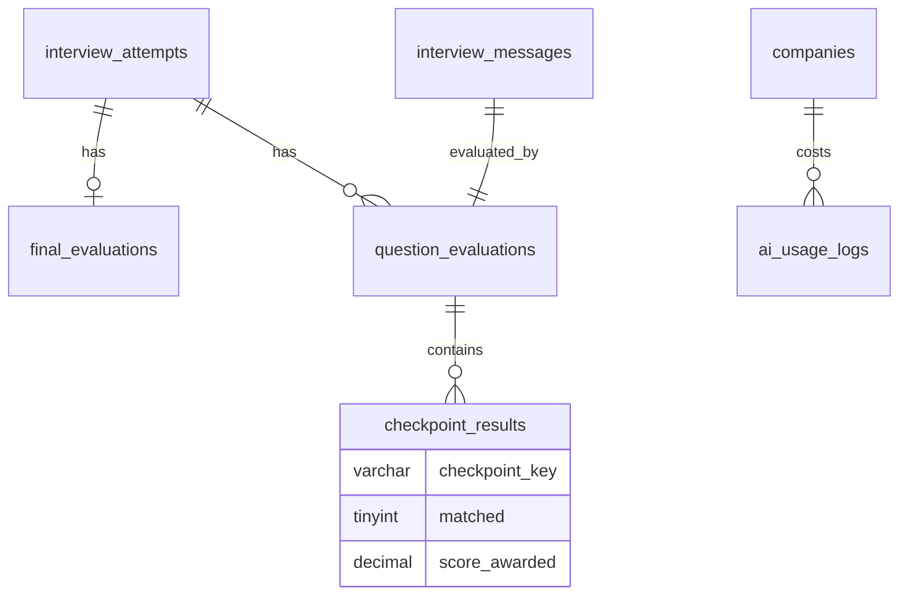

# AI Evaluation Schema

AI сравнивает ответ с checkpoint snapshot, возвращает structured JSON + normalized rows.

**Migration:** `007_create_ai_evaluation.sql` · **Feature block:** `07-⬜-ai-evaluation`

---

## Design principle

```txt
AI НЕ придумывает новые criteria — checkpoint_key MUST exist in interview_question_checkpoints
```

Application guardrail: reject AI output with unknown keys.

---

## ER diagram



---

## `question_evaluations`

One evaluation per candidate message (UNIQUE on `interview_message_id`).

| Column | Notes |
|--------|-------|
| `score`, `max_score` | DECIMAL(5,2) |
| `raw_response` | JSON — full AI payload |
| `short_summary`, `review` | Parsed text |
| `needs_manual_review` | Guardrail flag |

---

## `checkpoint_results`

| Column | Notes |
|--------|-------|
| `checkpoint_key` | Must match snapshot |
| `matched` | TINYINT(1) |
| `score_awarded` | DECIMAL(5,2) |
| `evidence_quote` | Quote from transcript |

UNIQUE `(question_evaluation_id, checkpoint_key)`

---

## `final_evaluations`

One per attempt (UNIQUE `interview_attempt_id`).

| Column | Notes |
|--------|-------|
| `total_score` | DECIMAL(5,2), scale 0–10 |
| `category` | weak \| basic \| average \| good \| strong |
| `hire_recommendation` | strong_reject … strong_invite |
| `summary`, `detailed_summary` | TEXT |
| `strengths`, `weaknesses`, `risks` | JSON arrays |
| `raw_response` | JSON audit |

---

## `ai_usage_logs`

Cost tracking for analytics block 08.

| Column | Notes |
|--------|-------|
| `provider`, `model` | e.g. openai, gpt-4o |
| `operation_type` | evaluate_answer, final_summary, … |
| `prompt_tokens`, `completion_tokens` | INT |
| `cost_usd` | DECIMAL(12,6) |
| `company_id` | Tenant rollup |

---

## JSON → rows example

AI returns:

```json
{
  "score": 3,
  "maxScore": 5,
  "matchedCheckpoints": ["side_effects", "dependency_array", "run_timing"],
  "missedCheckpoints": ["cleanup", "example"]
}
```

Maps to:

- `question_evaluations.score = 3`
- `checkpoint_results` rows for each snapshot key with `matched=1/0`

---

## DDL reference

`backend/migrations/007_create_ai_evaluation.sql`

---

## Related

- [`interview-core.md`](interview-core.md) — messages, attempts
- [`analytics-cost.md`](analytics-cost.md) — cost rollups from `ai_usage_logs`
