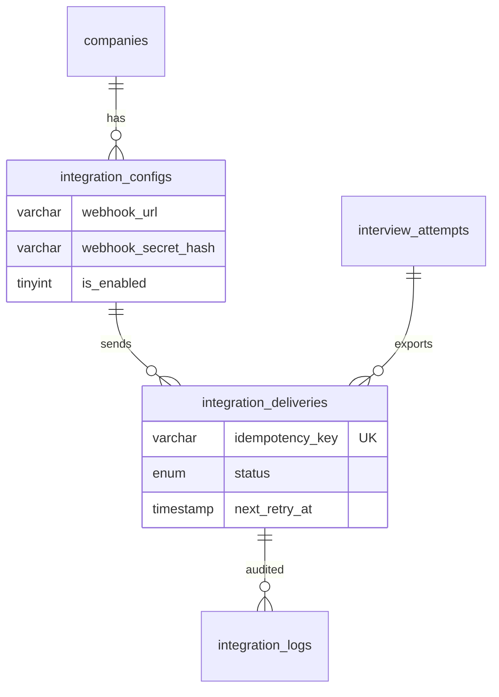

# ATS Integrations Schema

Webhook config, delivery queue, audit logs для экспорта результатов кандидатов.

**Migration:** `010_create_ats_integrations.sql` · **Feature block:** `10-⬜-ats-integrations`

---

## ER diagram



---

## `integration_configs`

| Column | Notes |
|--------|-------|
| `webhook_url` | Target URL |
| `webhook_secret_hash` | **Hashed** secret (bcrypt/argon2), never plaintext |
| `is_enabled` | Toggle |
| `max_attempts` | Default retry limit |
| `provider` | webhook \| greenhouse \| … |

All rows `company_id` scoped, FK CASCADE on company delete.

---

## `integration_deliveries`

Idempotency: UNIQUE `(company_id, idempotency_key)` where key = `{attempt_id}:{config_id}`.

| Status | Meaning |
|--------|---------|
| pending | Queued |
| in_progress | HTTP in flight |
| delivered | Success |
| failed | Max retries exceeded |
| cancelled | Manual cancel |

| Column | Notes |
|--------|-------|
| `attempt_count` | Delivery tries |
| `next_retry_at` | Exponential backoff scheduler |
| `last_error` | Last failure message |

**Retry policy (design):** exponential backoff: 1m, 5m, 15m, 1h, 4h; max `max_attempts`.

---

## `integration_logs`

Per HTTP attempt audit:

| Column | Notes |
|--------|-------|
| `attempt_number` | 1-based |
| `http_status` | Response code |
| `request_payload`, `response_payload` | JSON |
| `duration_ms` | Latency |

**Retention:** 90 days design default; purge job in block 10/11.

---

## Example webhook payload (PROJECT.md §17)

```json
{
  "candidate": {
    "fullName": "John Doe",
    "email": "john@example.com"
  },
  "interview": {
    "title": "Frontend React Developer",
    "level": "middle"
  },
  "result": {
    "score": 7.4,
    "category": "good",
    "hireRecommendation": "invite",
    "summary": "Candidate has solid React knowledge..."
  }
}
```

Built from: `candidates` + `interviews` + `final_evaluations`.

---

## DDL reference

`backend/migrations/010_create_ats_integrations.sql`

---

## Related

- [`interview-core.md`](interview-core.md) — attempt data
- [`ai-evaluation.md`](ai-evaluation.md) — final_evaluations
