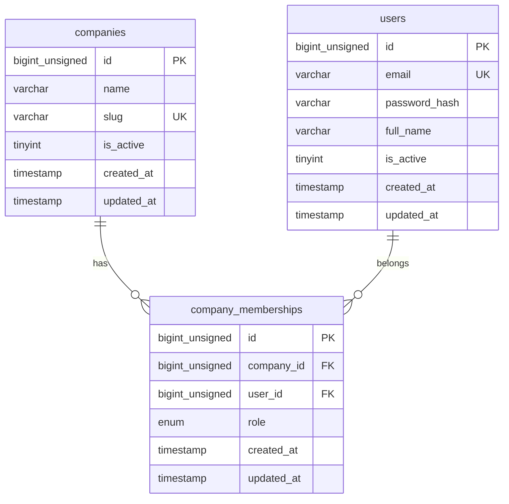

# Auth & Company Schema

Design doc для B2B multi-tenant auth: компании, пользователи, членство.

**Domain:** auth-company  
**Feature block:** `04-⬜-auth-company`  
**Migration group:** `002`–`004` (см. [`MIGRATIONS.md`](../MIGRATIONS.md))  
**Conventions:** [`CONVENTIONS.md`](../CONVENTIONS.md)

---

## Бизнес-правила

1. **Регистрация** — пользователь создаёт аккаунт и **новую компанию** в одном flow (блок 04).
2. **Первый пользователь** компании получает роль `owner` в `company_memberships`.
3. **User — global account** — таблица `users` **не содержит** `company_id`. Доступ к tenant через `company_memberships`.
4. **Multi-company (future)** — один `user` может иметь несколько memberships; MVP UI работает с одной «текущей» компанией из JWT/context.
5. **Login lookup** — по `users.email` (unique, case-sensitive storage; normalization в application layer).
6. **Пароли** — только `password_hash` (bcrypt), plaintext never stored.
7. **Soft delete users** — **не используется в MVP**; деактивация через `users.is_active = 0`.
8. **Sessions / refresh tokens** — **не в этой схеме** (JWT access token only в блоке 04; Redis sessions — post-MVP).

---

## ER diagram



---

## Таблицы

### `companies`

Root tenant. Все company-scoped данные в других доменах ссылаются на `companies.id`.

| Column | Type | Null | Default | Comment |
|--------|------|------|---------|---------|
| `id` | `BIGINT UNSIGNED` | NO | AUTO_INCREMENT | PK |
| `name` | `VARCHAR(255)` | NO | — | Display name компании |
| `slug` | `VARCHAR(64)` | NO | — | URL-safe unique identifier |
| `is_active` | `TINYINT(1)` | NO | `1` | `0` = deactivated tenant |
| `created_at` | `TIMESTAMP` | NO | `CURRENT_TIMESTAMP` | UTC |
| `updated_at` | `TIMESTAMP` | NO | `CURRENT_TIMESTAMP ON UPDATE` | UTC |

**Constraints:**

| Name | Type | Definition |
|------|------|------------|
| `PRIMARY` | PK | (`id`) |
| `uq_companies_slug` | UNIQUE | (`slug`) |

**Indexes:**

| Name | Columns | Rationale |
|------|---------|-----------|
| `uq_companies_slug` | `slug` | Unique tenant slug for lookup / future URLs |
| `idx_companies_is_active` | `is_active` | Filter active tenants (optional admin queries) |

**Notes:**

- `slug` генерируется при регистрации из `name` + suffix при collision (application layer).
- `companies` — **не** company-scoped (не имеет `company_id` на себе).

---

### `users`

Global user account. Один email = один user.

| Column | Type | Null | Default | Comment |
|--------|------|------|---------|---------|
| `id` | `BIGINT UNSIGNED` | NO | AUTO_INCREMENT | PK |
| `email` | `VARCHAR(255)` | NO | — | Login identifier, unique |
| `password_hash` | `VARCHAR(255)` | NO | — | bcrypt hash, never plaintext |
| `full_name` | `VARCHAR(255)` | NO | — | Display name |
| `is_active` | `TINYINT(1)` | NO | `1` | `0` = login disabled |
| `created_at` | `TIMESTAMP` | NO | `CURRENT_TIMESTAMP` | UTC |
| `updated_at` | `TIMESTAMP` | NO | `CURRENT_TIMESTAMP ON UPDATE` | UTC |

**Constraints:**

| Name | Type | Definition |
|------|------|------------|
| `PRIMARY` | PK | (`id`) |
| `uq_users_email` | UNIQUE | (`email`) |

**Indexes:**

| Name | Columns | Rationale |
|------|---------|-----------|
| `uq_users_email` | `email` | Login lookup by email (`SELECT ... WHERE email = ?`) |
| `idx_users_is_active` | `is_active` | Filter active accounts |

**Soft delete policy (MVP):**

- Колонки `deleted_at` **нет**.
- «Удаление» пользователя = `is_active = 0` или hard delete (admin-only, post-MVP).
- Hard delete user каскадно удалит `company_memberships` (FK CASCADE).

**Notes:**

- `users` **без** `company_id` — согласовано с [`CONVENTIONS.md`](../CONVENTIONS.md) (global entity).
- Email хранится as-is; lowercase normalization рекомендуется в AuthService перед INSERT/SELECT.

---

### `company_memberships`

Junction: user ↔ company + role. Tenant isolation для auth guards строится на membership.

| Column | Type | Null | Default | Comment |
|--------|------|------|---------|---------|
| `id` | `BIGINT UNSIGNED` | NO | AUTO_INCREMENT | PK |
| `company_id` | `BIGINT UNSIGNED` | NO | — | FK → `companies.id` |
| `user_id` | `BIGINT UNSIGNED` | NO | — | FK → `users.id` |
| `role` | `ENUM('owner','member')` | NO | `'member'` | Role within company |
| `created_at` | `TIMESTAMP` | NO | `CURRENT_TIMESTAMP` | UTC |
| `updated_at` | `TIMESTAMP` | NO | `CURRENT_TIMESTAMP ON UPDATE` | UTC |

**Role values:**

| Value | Meaning |
|-------|---------|
| `owner` | Created company / full access in MVP |
| `member` | Regular team member (invite flow — post-MVP) |

**Constraints:**

| Name | Type | Definition |
|------|------|------------|
| `PRIMARY` | PK | (`id`) |
| `uq_company_memberships_company_user` | UNIQUE | (`company_id`, `user_id`) |
| `fk_company_memberships_company` | FK | `company_id` → `companies(id)` ON DELETE CASCADE |
| `fk_company_memberships_user` | FK | `user_id` → `users(id)` ON DELETE CASCADE |

**Indexes:**

| Name | Columns | Rationale |
|------|---------|-----------|
| `uq_company_memberships_company_user` | `company_id`, `user_id` | One membership per user per company |
| `idx_company_memberships_user_id` | `user_id` | List companies for user (`me` query) |
| `idx_company_memberships_company_id` | `company_id` | List members of company (post-MVP) |
| `idx_company_memberships_company_role` | `company_id`, `role` | Find owners of company |

**Notes:**

- `company_id` здесь — tenant scope для **access control**, не дублирование на `users`.
- MVP register: один INSERT с `role = 'owner'`.
- JWT payload (блок 04) может включать `user_id` + `company_id` + `role` из membership.

---

## Relationships summary

```txt
companies 1 ──< company_memberships >── 1 users
```

- **Нет** прямого FK `users` → `companies`.
- Tenant context для API: `company_memberships.company_id` + `company_memberships.role`.

---

## Register flow (data writes)

```txt
1. INSERT companies (name, slug)
2. INSERT users (email, password_hash, full_name)
3. INSERT company_memberships (company_id, user_id, role='owner')
```

Все три операции — в одной application transaction (блок 04 AuthService).

---

## Login flow (data reads)

```txt
1. SELECT * FROM users WHERE email = ? AND is_active = 1
2. verify password_hash (bcrypt, application layer)
3. SELECT cm.*, c.name, c.slug
     FROM company_memberships cm
     JOIN companies c ON c.id = cm.company_id
    WHERE cm.user_id = ?
      AND c.is_active = 1
   ORDER BY cm.created_at ASC
   LIMIT 1   -- MVP: first/primary company
```

---

## DDL design reference

> Design reference only. Deploy via `backend/migrations/` in block 04.

### Migration files (planned)

Блок 04 (`TASK-04.1`) использует три последовательных файла:

```txt
002_create_companies.sql
003_create_users.sql
004_create_company_memberships.sql
```

Альтернатива — один file `002_create_auth_company.sql` (все три таблицы), если preferred single change set. Рекомендация: **три файла** для явного FK order и review.

### `002_create_companies.sql`

```sql
-- Domain: auth-company (docs/database/schemas/auth-company.md)
-- Depends on: 001_create_schema_migrations.sql

CREATE TABLE IF NOT EXISTS companies (
  id BIGINT UNSIGNED NOT NULL AUTO_INCREMENT,
  name VARCHAR(255) NOT NULL,
  slug VARCHAR(64) NOT NULL,
  is_active TINYINT(1) NOT NULL DEFAULT 1,
  created_at TIMESTAMP NOT NULL DEFAULT CURRENT_TIMESTAMP,
  updated_at TIMESTAMP NOT NULL DEFAULT CURRENT_TIMESTAMP ON UPDATE CURRENT_TIMESTAMP,
  PRIMARY KEY (id),
  UNIQUE KEY uq_companies_slug (slug),
  KEY idx_companies_is_active (is_active)
) ENGINE=InnoDB DEFAULT CHARSET=utf8mb4 COLLATE=utf8mb4_unicode_ci;
```

### `003_create_users.sql`

```sql
-- Domain: auth-company (docs/database/schemas/auth-company.md)
-- Depends on: 002_create_companies.sql

CREATE TABLE IF NOT EXISTS users (
  id BIGINT UNSIGNED NOT NULL AUTO_INCREMENT,
  email VARCHAR(255) NOT NULL,
  password_hash VARCHAR(255) NOT NULL,
  full_name VARCHAR(255) NOT NULL,
  is_active TINYINT(1) NOT NULL DEFAULT 1,
  created_at TIMESTAMP NOT NULL DEFAULT CURRENT_TIMESTAMP,
  updated_at TIMESTAMP NOT NULL DEFAULT CURRENT_TIMESTAMP ON UPDATE CURRENT_TIMESTAMP,
  PRIMARY KEY (id),
  UNIQUE KEY uq_users_email (email),
  KEY idx_users_is_active (is_active)
) ENGINE=InnoDB DEFAULT CHARSET=utf8mb4 COLLATE=utf8mb4_unicode_ci;
```

### `004_create_company_memberships.sql`

```sql
-- Domain: auth-company (docs/database/schemas/auth-company.md)
-- Depends on: 002_create_companies.sql, 003_create_users.sql

CREATE TABLE IF NOT EXISTS company_memberships (
  id BIGINT UNSIGNED NOT NULL AUTO_INCREMENT,
  company_id BIGINT UNSIGNED NOT NULL,
  user_id BIGINT UNSIGNED NOT NULL,
  role ENUM('owner', 'member') NOT NULL DEFAULT 'member',
  created_at TIMESTAMP NOT NULL DEFAULT CURRENT_TIMESTAMP,
  updated_at TIMESTAMP NOT NULL DEFAULT CURRENT_TIMESTAMP ON UPDATE CURRENT_TIMESTAMP,
  PRIMARY KEY (id),
  UNIQUE KEY uq_company_memberships_company_user (company_id, user_id),
  KEY idx_company_memberships_user_id (user_id),
  KEY idx_company_memberships_company_id (company_id),
  KEY idx_company_memberships_company_role (company_id, role),
  CONSTRAINT fk_company_memberships_company
    FOREIGN KEY (company_id) REFERENCES companies (id) ON DELETE CASCADE,
  CONSTRAINT fk_company_memberships_user
    FOREIGN KEY (user_id) REFERENCES users (id) ON DELETE CASCADE
) ENGINE=InnoDB DEFAULT CHARSET=utf8mb4 COLLATE=utf8mb4_unicode_ci;
```

---

## Multi-tenant alignment

| Table | Scoped? | `company_id` |
|-------|---------|--------------|
| `companies` | tenant root | — |
| `users` | global | — (access via memberships) |
| `company_memberships` | access junction | yes (`company_id` FK) |

Все **будущие** company-scoped таблицы (`interviews`, `candidates`, …) получают `company_id NOT NULL` + FK → `companies.id` по [`CONVENTIONS.md`](../CONVENTIONS.md).

---

## Согласование с блоком 04

| Block 04 requirement | Design doc |
|---------------------|------------|
| `users`, `companies`, `company_memberships` | ✅ три таблицы |
| `password_hash`, never plaintext | ✅ `VARCHAR(255)` |
| UNIQUE `users.email`, `companies.slug` | ✅ |
| `company_memberships.role` owner/member | ✅ ENUM |
| FK CASCADE on membership | ✅ |
| Register creates company + user + owner membership | ✅ flow documented |
| JWT access token (no sessions table) | ✅ out of schema |
| GraphQL `me` returns user + company | ✅ via membership JOIN |

---

## Out of scope (explicit)

- `sessions` / refresh token storage (Redis/DB)
- OAuth / SSO / MFA
- `email_verified_at`, password reset tokens
- Team invite tokens
- Roles beyond `owner` / `member`
- `users.deleted_at` soft delete

---

## Checklist (block 04 migration PR)

- [ ] Design doc link in migration file headers
- [ ] Files `002`, `003`, `004` sequential
- [ ] `CREATE TABLE IF NOT EXISTS`
- [ ] FK + indexes in same file as table
- [ ] `pnpm run migrate` succeeds
- [ ] `SHOW CREATE TABLE` matches this doc
- [ ] UNIQUE on duplicate email/slug fails as expected

---

## Related documents

- [`../CONVENTIONS.md`](../CONVENTIONS.md) — naming, types, multi-tenant
- [`../MIGRATIONS.md`](../MIGRATIONS.md) — migration policy
- `docs/tasks/list/04-⬜-auth-company/` — implementation block
