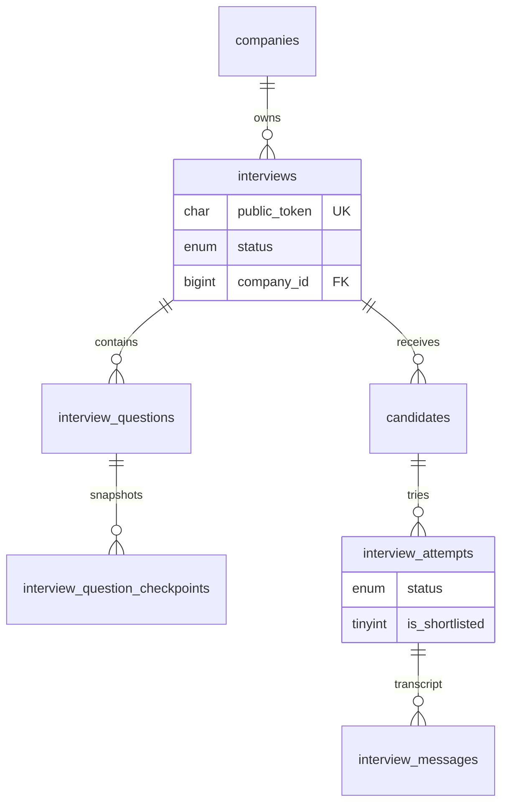

# Interview Core Schema

Interview domain: company создаёт интервью, кандидат проходит attempt, messages хранят transcript.

**Migration:** `006_create_interview_core.sql` · **Feature block:** `06-⬜-interview-core`

---

## ER overview



---

## `interviews`

| Column | Notes |
|--------|-------|
| `company_id` | Tenant isolation, FK RESTRICT |
| `public_token` | CHAR(36) UUID v4, UNIQUE — **not PK** |
| `status` | draft \| active \| archived |
| `level`, `question_count`, `interview_language` | Config |
| `is_video_enabled` | Video flag |
| `interviewer_name` | Optional AI interviewer display name for welcome TTS |
| `welcome_message_template` | Optional welcome text with `{{candidateName}}`, `{{interviewerName}}`, `{{jobRole}}`, `{{title}}`, `{{questionCount}}` |

**Public token policy:** crypto-random UUID v4, generated in application, never sequential IDs in URLs.

**Indexes:** `(company_id, created_at)`, `(company_id, status)`, UNIQUE `public_token`

---

## Snapshot strategy (normalized)

**Choice:** normalized snapshot tables, not JSON blob.

| Source | Snapshot table |
|--------|----------------|
| `questions` | `interview_questions` |
| `question_checkpoints` (+ `evaluation_hints`) | `interview_question_checkpoints` |
| `answer_examples` | `interview_answer_examples` |

Rationale: checkpoint keys queryable, FK integrity, AI eval matches keys exactly.

`interview_questions` also stores `topic_name` (denormalized label for analytics) and `topic_weight` (snapshot of `topics.interview_weight` at interview creation).

---

## `candidates`

| Column | Notes |
|--------|-------|
| `interview_id` | FK CASCADE |
| `company_id` | Tenant |
| `email` | UNIQUE per `(interview_id, email)` |

---

## `interview_attempts`

| Status | Meaning |
|--------|---------|
| `pending` | Registered, not started |
| `in_progress` | Active interview |
| `completed` | Finished |
| `abandoned` | Dropped |

| Column | Notes |
|--------|-------|
| `is_shortlisted` | Analytics shortlist flag (see analytics-cost.md) |
| `started_at`, `completed_at` | Lifecycle timestamps |

**State machine:**

```txt
pending → in_progress → completed
         ↘ abandoned
```

**Indexes:** `(company_id, status)`, `(interview_id, status)`, `(company_id, is_shortlisted)`

---

## `interview_messages`

| Column | Notes |
|--------|-------|
| `role` | `ai` \| `candidate` |
| `content` | Message text / transcript |
| `sequence_order` | UNIQUE per attempt |
| `interview_question_id` | Links AI question to snapshot |

---

## DDL reference

`backend/migrations/006_create_interview_core.sql`

---

## Related

- [`question-bank.md`](question-bank.md) — source questions
- [`ai-evaluation.md`](ai-evaluation.md) — evaluations per message
