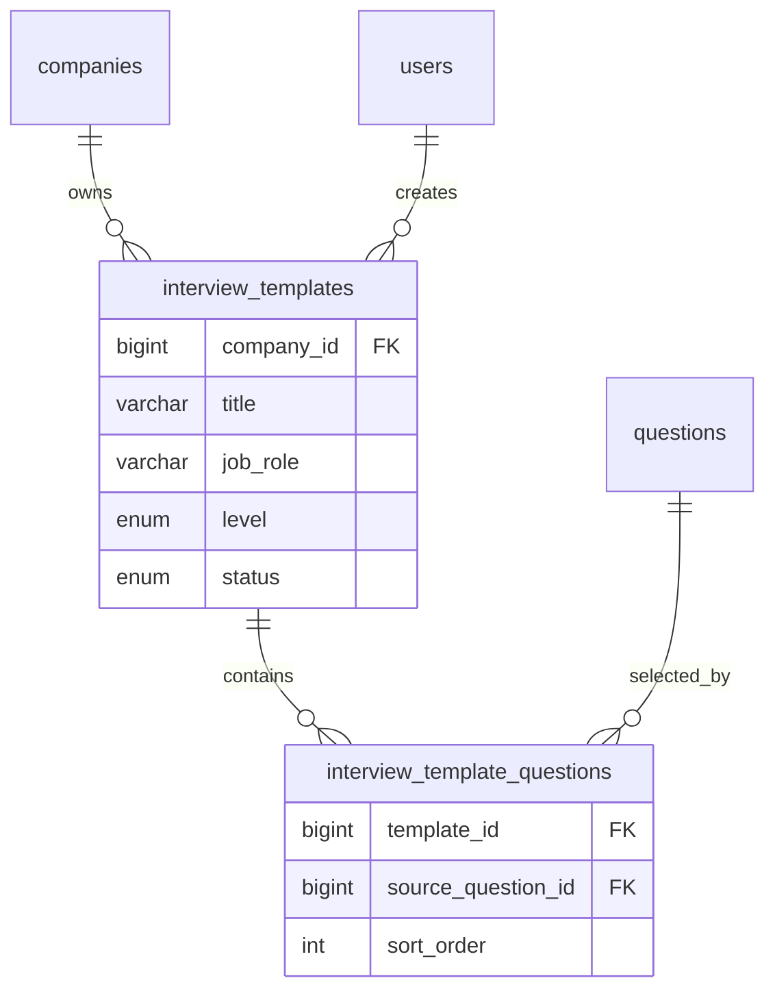

# Interview Templates Schema

Interview templates store reusable company-owned interview blueprints.

**Planned migration:** `019_create_interview_templates.sql` · **Feature block:** `15-🟡-interview-templates`

---

## ER Overview



---

## `interview_templates`

Company-scoped reusable blueprint for creating `interviews`.

| Column | Type | Notes |
|--------|------|-------|
| `id` | `BIGINT UNSIGNED` | Internal PK |
| `company_id` | `BIGINT UNSIGNED` | Tenant isolation, FK RESTRICT |
| `created_by_user_id` | `BIGINT UNSIGNED NULL` | Audit, FK SET NULL |
| `title` | `VARCHAR(255)` | Template display name |
| `job_role` | `VARCHAR(255)` | Role copied into new interview |
| `profession_id` | `BIGINT UNSIGNED NULL` | Optional profession FK |
| `level` | `ENUM('junior', 'middle', 'senior', 'lead')` | Candidate level |
| `interview_language` | `VARCHAR(16)` | Defaults to `ru` |
| `question_count` | `INT UNSIGNED` | Denormalized count for list UI |
| `job_description` | `TEXT NULL` | Optional vacancy context |
| `is_video_enabled` | `TINYINT(1)` | Copied into interview |
| `interviewer_name` | `VARCHAR(255) NULL` | Optional AI interviewer display name |
| `welcome_message_template` | `TEXT NULL` | Optional welcome text |
| `status` | `ENUM('active', 'archived')` | Soft lifecycle without deleting rows |
| `created_at`, `updated_at` | `TIMESTAMP` | Standard timestamps |

### Indexes

```sql
PRIMARY KEY (id)
KEY idx_interview_templates_company_updated (company_id, updated_at)
KEY idx_interview_templates_company_status (company_id, status)
KEY idx_interview_templates_company_role_level (company_id, job_role, level)
KEY idx_interview_templates_profession_id (profession_id)
KEY idx_interview_templates_created_by_user (created_by_user_id)
```

### Foreign Keys

```sql
CONSTRAINT fk_interview_templates_company
  FOREIGN KEY (company_id) REFERENCES companies (id) ON DELETE RESTRICT

CONSTRAINT fk_interview_templates_created_by_user
  FOREIGN KEY (created_by_user_id) REFERENCES users (id) ON DELETE SET NULL

CONSTRAINT fk_interview_templates_profession
  FOREIGN KEY (profession_id) REFERENCES professions (id) ON DELETE SET NULL
```

---

## `interview_template_questions`

Ordered references from a template to source question bank questions.

| Column | Type | Notes |
|--------|------|-------|
| `id` | `BIGINT UNSIGNED` | Internal PK |
| `template_id` | `BIGINT UNSIGNED` | FK to `interview_templates` |
| `source_question_id` | `BIGINT UNSIGNED` | FK to `questions` |
| `sort_order` | `INT UNSIGNED` | Order inside template |
| `created_at` | `TIMESTAMP` | Standard creation timestamp |

### Indexes

```sql
PRIMARY KEY (id)
UNIQUE KEY uq_interview_template_questions_sort (template_id, sort_order)
UNIQUE KEY uq_interview_template_questions_source (template_id, source_question_id)
KEY idx_interview_template_questions_template_sort (template_id, sort_order)
KEY idx_interview_template_questions_source_question (source_question_id)
```

### Foreign Keys

```sql
CONSTRAINT fk_interview_template_questions_template
  FOREIGN KEY (template_id) REFERENCES interview_templates (id) ON DELETE CASCADE

CONSTRAINT fk_interview_template_questions_source_question
  FOREIGN KEY (source_question_id) REFERENCES questions (id) ON DELETE RESTRICT
```

`ON DELETE RESTRICT` для `source_question_id` выбран специально: если вопрос используется в template, его нельзя физически удалить без явного product decision. Для обычного lifecycle question bank должен использовать `is_active` / `deleted_at`.

---

## Snapshot Boundary

Template не является snapshot.

Template stores:

- metadata for future interview creation;
- ordered list of `source_question_id`.

Interview stores:

- immutable `interview_questions`;
- immutable `interview_question_checkpoints`;
- public token and lifecycle status;
- candidate attempts and results.

`createInterviewFromTemplate` must load template questions, validate visibility through question bank rules, then call existing interview creation flow.

---

## DDL Preview

```sql
CREATE TABLE IF NOT EXISTS interview_templates (
  id BIGINT UNSIGNED NOT NULL AUTO_INCREMENT,
  company_id BIGINT UNSIGNED NOT NULL,
  created_by_user_id BIGINT UNSIGNED NULL,
  title VARCHAR(255) NOT NULL,
  job_role VARCHAR(255) NOT NULL,
  profession_id BIGINT UNSIGNED NULL,
  level ENUM('junior', 'middle', 'senior', 'lead') NOT NULL,
  interview_language VARCHAR(16) NOT NULL DEFAULT 'ru',
  question_count INT UNSIGNED NOT NULL DEFAULT 0,
  job_description TEXT NULL,
  is_video_enabled TINYINT(1) NOT NULL DEFAULT 0,
  interviewer_name VARCHAR(255) NULL,
  welcome_message_template TEXT NULL,
  status ENUM('active', 'archived') NOT NULL DEFAULT 'active',
  created_at TIMESTAMP NOT NULL DEFAULT CURRENT_TIMESTAMP,
  updated_at TIMESTAMP NOT NULL DEFAULT CURRENT_TIMESTAMP ON UPDATE CURRENT_TIMESTAMP,
  PRIMARY KEY (id),
  KEY idx_interview_templates_company_updated (company_id, updated_at),
  KEY idx_interview_templates_company_status (company_id, status),
  KEY idx_interview_templates_company_role_level (company_id, job_role, level),
  KEY idx_interview_templates_profession_id (profession_id),
  KEY idx_interview_templates_created_by_user (created_by_user_id),
  CONSTRAINT fk_interview_templates_company
    FOREIGN KEY (company_id) REFERENCES companies (id) ON DELETE RESTRICT,
  CONSTRAINT fk_interview_templates_created_by_user
    FOREIGN KEY (created_by_user_id) REFERENCES users (id) ON DELETE SET NULL,
  CONSTRAINT fk_interview_templates_profession
    FOREIGN KEY (profession_id) REFERENCES professions (id) ON DELETE SET NULL
) ENGINE=InnoDB DEFAULT CHARSET=utf8mb4 COLLATE=utf8mb4_unicode_ci;

CREATE TABLE IF NOT EXISTS interview_template_questions (
  id BIGINT UNSIGNED NOT NULL AUTO_INCREMENT,
  template_id BIGINT UNSIGNED NOT NULL,
  source_question_id BIGINT UNSIGNED NOT NULL,
  sort_order INT UNSIGNED NOT NULL DEFAULT 0,
  created_at TIMESTAMP NOT NULL DEFAULT CURRENT_TIMESTAMP,
  PRIMARY KEY (id),
  UNIQUE KEY uq_interview_template_questions_sort (template_id, sort_order),
  UNIQUE KEY uq_interview_template_questions_source (template_id, source_question_id),
  KEY idx_interview_template_questions_template_sort (template_id, sort_order),
  KEY idx_interview_template_questions_source_question (source_question_id),
  CONSTRAINT fk_interview_template_questions_template
    FOREIGN KEY (template_id) REFERENCES interview_templates (id) ON DELETE CASCADE,
  CONSTRAINT fk_interview_template_questions_source_question
    FOREIGN KEY (source_question_id) REFERENCES questions (id) ON DELETE RESTRICT
) ENGINE=InnoDB DEFAULT CHARSET=utf8mb4 COLLATE=utf8mb4_unicode_ci;
```

---

## Access Rules

- All queries filter by `company_id = currentUser.companyId`.
- Archived templates are hidden from default lists.
- Creating interview from template must reject templates outside current company.
- Creating interview from template must reject templates with zero questions.
- Creating interview from template must validate that each `source_question_id` is still visible/active for the company.

---

## Related

- `docs/interview-templates/README.md`
- `docs/database/schemas/interview-core.md`
- `docs/database/schemas/question-bank.md`
