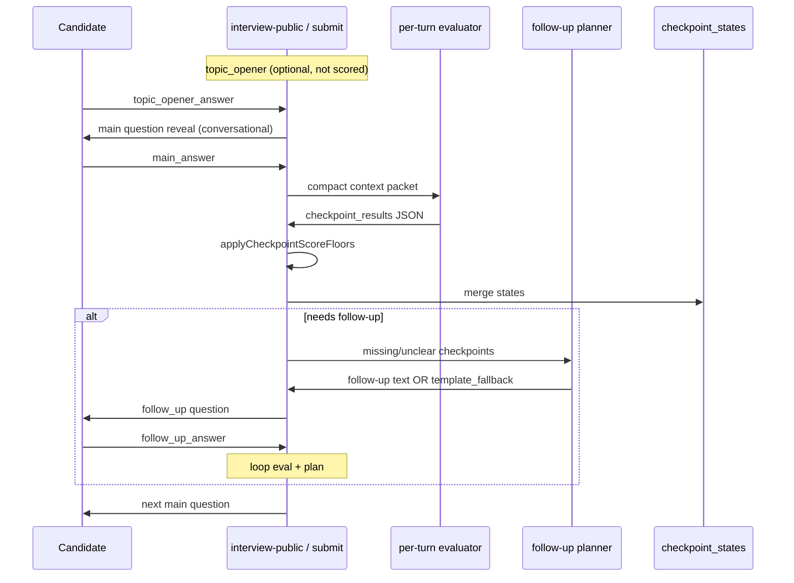

# Evaluation Accuracy & Interview Analytics — Design Reference

> **Для нового агента:** этот документ — source of truth по проблеме завышенных оценок, текущему состоянию системы и плану улучшений.  
> Реализация разбита на subtasks в `docs/tasks/list/14-⬜-evaluation-accuracy-analytics/`.  
> **Один prompt = один subtask.** Не делать весь блок сразу.

---

## 1. Executive Summary

### Продуктовая цель

AI-интервью оценивает кандидата **строго по checkpoint snapshot** из question bank. HR должен видеть:

- сколько кандидат **реально понимает** (accuracy),
- что он **упомянул, но не объяснил** (surface coverage),
- где есть **ложные уверенные утверждения** (red flags),
- насколько можно **доверять** автоматической оценке (confidence / manual review).

### Главная проблема (обнаружена на реальном прогоне)

**Attempt 34, Interview 4** — намеренно «50% правда / 50% бред» по вопросу React Fiber:

| Метрика | Факт | Ожидание |
|---------|------|----------|
| Checkpoints covered | 7/8 | ~3–4/8 |
| Final score | **8.8/10** | **~4.5–5.5/10** |
| Follow-ups | 5 штук, все robotic | 1–2 естественных или ранний stop |

Формула final score: `(earned_checkpoints / max_checkpoints) × 10`.  
7/8 × 10 = 8.8 — математически верно, но **семантически неверно**, потому что AI засчитал почти все checkpoints как `covered`.

### Три корневые причины

1. **Evaluator prompt** не различал «упомянул термин» vs «понимает механизм» → `covered` + `score=max` при смешанных ответах.
2. **Post-guards** (`apply-checkpoint-score-floors`) были слабые — не ловили все contradiction patterns.
3. **Follow-up planner** падал в `combined_turn_template_fallback` → роботизированные фразы + утечка rubric-текста в вопрос кандидату; follow-ups не останавливались при «достаточном» score.

### Что уже сделано (commit `f93b32b`)

- Topic opener flow (2-step intro, не скорится).
- React Fiber question в seed.
- Prompt v2.4.0: explicit half-right/half-wrong → `partial` ~0.5.
- Guards: Fiber-specific contradictions, rationale-based cap.
- Follow-up variety: `follow-up-acknowledgment.util`, обновлён `interviewer-voice.prompt`.

### Что ещё нужно (блок 14)

См. [приоритеты](#12-приоритет-реализации) и `docs/tasks/list/14-⬜-evaluation-accuracy-analytics/TASKS.md`.

---

## 2. Glossary

| Термин | Значение |
|--------|----------|
| **Checkpoint** | Атом оценки из question bank snapshot (`interview_question_checkpoints`). Имеет `checkpoint_key`, `title`, `expected`, `max_score`. |
| **Coverage** | Кандидат **затронул тему** checkpoint (назвал термин, намекнул на область). Не означает правильность. |
| **Accuracy** | Кандидат **корректно объяснил** суть checkpoint без material false claims. |
| **Surface mention** | Упомянул слово/концепт без объяснения → max `partial` или `missed`, не `covered`. |
| **Understands** | Может связно объяснить механизм своими словами → кандидат на `covered`. |
| **Knows** | Даёт точные детали, отвечает на follow-up без противоречий → `covered`. |
| **Heard of** | «Слышал про Fiber / reconciliation» без деталей → `partial` или `unclear`. |
| **Material false claim** | Уверенное неверное утверждение по сути checkpoint (не мелкая неточность). |
| **Per-turn evaluation** | AI call после каждого ответа кандидата; обновляет `interview_checkpoint_states`. |
| **Follow-up planner** | AI call для выбора checkpoint и формулировки уточняющего вопроса. |
| **Template fallback** | Детерминированный шаблон без LLM (`combined_turn_template_fallback`) — **антипаттерн** для UX. |
| **Guards** | `apply-checkpoint-score-floors.util.ts` — post-processing AI JSON до merge в state. |

### Шкала «понимает / знает / слышал / упомянул»

Это **не отдельные enum в БД** (пока), а **семантическая таксономия для prompt + UI**:

```txt
упомянул (mention only)     → missed или partial низкий (0–0.25)
слышал (heard of)           → partial низкий (0.25–0.4) или unclear
знает поверхностно          → partial (0.4–0.6)
понимает с неточностями     → partial (0.5–0.6), НЕ covered
понимает / знает точно      → covered (1.0)
уверенно врёт               → missed (0), red flag
```

**Ключевое правило для prompt:** `covered` только когда accuracy = полная, без material false claims. Упоминание термина **никогда** не даёт `covered`.

---

## 3. Current Architecture

### Flow одного main question



### Source of truth

- Question bank → snapshot при создании interview → `interview_question_checkpoints`.
- AI **не придумывает** новые критерии.
- `max_score` per checkpoint фиксирован.

### Key files

| Область | Файл |
|---------|------|
| Evaluator prompt | `backend/src/modules/adaptive-interview/prompts/per-turn-checkpoint-evaluation.prompt.ts` (v2.4.0) |
| Score guards | `backend/src/modules/adaptive-interview/utils/apply-checkpoint-score-floors.util.ts` |
| Follow-up policy | `backend/src/modules/adaptive-interview/utils/follow-up-policy.util.ts` |
| Follow-up planner | `backend/src/modules/adaptive-interview/services/follow-up-planner.service.ts` |
| Ack variety | `backend/src/modules/adaptive-interview/utils/follow-up-acknowledgment.util.ts` |
| Interviewer voice | `backend/src/modules/adaptive-interview/prompts/interviewer-voice.prompt.ts` |
| Submit orchestration | `backend/src/modules/adaptive-interview/services/adaptive-interview-submit.service.ts` |
| Topic opener | `backend/src/modules/adaptive-interview/services/main-question-opener.service.ts` |
| Fiber seed | `backend/seeds/question-bank.seed.sql` (topic `react_fiber`) |

### Scoring math

```txt
per_checkpoint: score_awarded ∈ [0, max_score]
per_question_raw: sum(score_awarded) / sum(max_score)  → например 7/8
final_display: (earned / max) × 10                     → 8.8/10
```

Checkpoint считается «закрытым» для follow-up policy когда `status ∈ {covered, partial}` и score выше порога — **это нужно ужесточить** (subtask 004).

---

## 4. Case Study: Attempt 34 (React Fiber)

### Сценарий

Кандидат намеренно давал ответы ~50% верных и ~50% ложных по checkpoints Fiber:

- Правильно: Fiber как reconciliation engine, child/sibling/return links (частично).
- Неправильно: `requestIdleCallback` drives scheduling, «Fiber stored in Virtual DOM», wrong `parent`/`next` semantics.

### Что пошло не так

1. **Evaluator** поставил `covered` + `1.0` на checkpoints, где rationale сама упоминала ошибки.
2. **Guards** (до v2.4.0) не срезали score.
3. **5 follow-ups** — planner использовал `combined_turn_template_fallback`, текст содержал rubric (`expected=...`).
4. Кандидат **добирал** score на follow-up ответах, иногда повторяя buzzwords.

### Expected после полного блока 14

Тот же сценарий → **~3.5–4.5/8** raw → **~4.5–5.5/10** final, с HR-отчётом:

- checkpoints с `partial` и rationale «упомянул, но объяснение неверно»,
- red flags: «уверенно утверждал requestIdleCallback»,
- confidence < 0.7 на спорных checkpoints → `needs_manual_review`.

### Как воспроизвести

```txt
1. npm run seed:question-bank (Fiber question)
2. Создать interview с этим вопросом
3. Пройти topic_opener → main answer с 50/50 контентом
4. Отвечать на follow-ups аналогично
5. Сравнить dashboard: /dashboard/interviews/{id}?attemptId={attemptId}
```

---

## 5. Problem Areas (детально)

### 5.1 Coverage vs Accuracy (главный продуктовый gap)

**Сейчас:** один axis — `status` + `score_awarded`. AI часто путает «назвал Fiber» с «понимает Fiber architecture».

**Нужно:**

1. **Prompt:** явная checklist-таблица per checkpoint:
   - Did candidate **mention** the topic? (coverage)
   - Did candidate **explain correctly**? (accuracy)
   - Any **false claims**?
2. **Optional schema extension** (migration): `coverage_level`, `accuracy_level` enum или numeric 0–1.
3. **UI:** две оси в HR report — не только «7/8 covered».

**Примеры для prompt (Fiber / scheduling):**

| Ответ кандидата | Coverage | Accuracy | Status | Score |
|-----------------|----------|----------|--------|-------|
| «Fiber — это reconciliation» | high | high | covered | 1.0 |
| «Слышал про Fiber, не помню» | low | none | unclear | 0 |
| «Fiber использует requestIdleCallback для scheduling» | high | **wrong** | partial | 0.5 |
| «Fiber, Virtual DOM, diffing» (keywords only) | medium | none | missed | 0 |

### 5.2 False claim penalty

**Сейчас:** guards ловят часть Fiber patterns в `applySemanticContradictionCap`.

**Нужно:**

- Расширить pattern library **или** generic NLP rule: если rationale contains «incorrect/contradictory/wrong» → cap score.
- Per-question **bad_answer_examples** из question bank → negative examples в evaluator context.
- «Confident tone» false statement хуже, чем «не уверен, но мысль верная».

### 5.3 Follow-up template fallback

**Сейчас:** `follow-up-planner.service.ts` → `combined_turn_template_fallback` когда combined turn не прошёл validation.

**Проблемы:**

- Шаблон вставляет `expected` checkpoint text → кандидат видит rubric.
- Одинаковое начало «Понял, спасибо.» (частично исправлено acknowledgment util).
- Нет conversational tone.

**Нужно:**

- Retry LLM с repair prompt (уже есть `follow-up-planner-repair.prompt.ts`) **до** fallback.
- Fallback = generic conversational probe, **без** rubric text.
- Metric: % fallback < 5%.

### 5.4 Follow-up stop-early

**Сейчас:** `follow-up-policy.util.ts` — лимиты по количеству, порог score.

**Нужно:**

- Stop когда `sum(score) / sum(max) >= 0.85` **и** нет missed с high coverage (buzzword only).
- Stop когда 2 follow-ups подряд не улучшили score.
- Разный вес: main_answer evidence > follow_up_answer evidence (subtask 014).

### 5.4.1 Follow-up budget (TASK-14.19)

**Реализовано:** deterministic **Weight Budget Allocator** (`probe-priority.util.ts`, `follow-up-budget-allocator.util.ts`).

- Глобальный бюджет: `ADAPTIVE_MAX_FOLLOW_UPS_PER_QUESTION=4` (default).
- **Priority** = `(weight/max) × gapScore × tierMultiplier × uncertaintyMultiplier`.
- **Per-checkpoint cap:** mention/basic → 0 (shallow only); heavy (weight ≥ 2 или advanced+) → до 2; иначе 1.
- Ниже `ADAPTIVE_MIN_PRIORITY_TO_PROBE` (0.15) → shallow accept без probe.
- `probeRequired` advanced checkpoints резервируют budget; early stop при sufficient score **не** срабатывает, пока такой probe pending.
- Turn user prompt: блок `Follow-up budget (this question)` в `buildInterviewPolicyTurnBlock`.

Env: `ADAPTIVE_MAX_FOLLOW_UPS_HEAVY_CHECKPOINT`, `ADAPTIVE_HEAVY_CHECKPOINT_WEIGHT_RATIO`, `ADAPTIVE_MIN_PRIORITY_TO_PROBE`. Bank override: `evaluation_hints.probePolicy.maxFollowUps`, `minPriorityToProbe`.

### 5.4.2 Transitive checkpoint floors (TASK-14.20)

Bank `impliesCheckpointFloors`: strong **source** checkpoint (≥75% max, probed/closed, no false claim) raises **floor** on related targets — never auto-`covered`. Fiber: scheduling → lanes_priority (0.5), fiber_definition (0.45); stack_vs_fiber → fiber_definition (0.55). Weak source (e.g. scheduling 0.25 unprobed) triggers nothing.

### 5.4.3 Topic mismatch redirect (TASK-14.21)

New disposition `misunderstood_question`: substantive answer about **wrong checkpoint** (e.g. useState when asked useEffect). Policy issues `topic_redirect` follow-up (priority above generic probe, max 1 per target via `redirect=asked`). Guards prevent immediate `missed` score 0 on expected checkpoint; cross-checkpoint credit on the answered checkpoint preserved.

### 5.5 HR Analytics / Report

**Сейчас:** dashboard показывает score, messages — без structured per-checkpoint HR view.

**Нужно:**

- Per-checkpoint card: title, status, score, rationale, evidence snippets.
- **Red flags** block: список material false claims.
- **Ideal answer diff**: collapsible сравнение с `ideal_answer` из snapshot.
- **Manual review** badge когда `needs_manual_review` или `confidence < threshold`.

### 5.6 Calibration & Quality Loop

**Нужно:**

- Golden set: 10–20 synthetic transcripts per canonical question (Fiber, useEffect, …) с expected checkpoint scores.
- CI test: evaluator output within tolerance vs golden.
- Log **AI vs guard** disagreements для анализа.
- A/B prompt versions (`PER_TURN_CHECKPOINT_EVALUATION_PROMPT_VERSION`).

### 5.7 Topic opener — not scored

**Сейчас:** `topic_opener` / `topic_opener_answer` message kinds (migration 015). Flow реализован.

**Verify:** submit service не вызывает evaluator на `topic_opener_answer`; только на `main_answer` и `follow_up_answer`.

---

## 6. Proposed Solutions (A–Q mapping)

| ID | Название | Суть | Subtask |
|----|----------|------|---------|
| A | Evaluator checklist | Coverage/accuracy/false-claim checklist в prompt | 001 |
| B | False claim penalty | Guards + bad examples из bank | 005 |
| C | Golden calibration set | Synthetic transcripts + CI | 002 |
| D | Confidence in UI | Показать confidence, manual review | 010 |
| E | LLM follow-ups | Убрать rubric template fallback | 003 |
| F | Early stop | Policy когда score sufficient | 004 |
| G | No rubric in follow-up | Sanitize fallback text | 003 |
| H | Checkpoint HR report | Dashboard per-checkpoint cards | 006 |
| I | Dual axis UI | Coverage vs accuracy визуализация | 007 |
| J | Ideal answer comparison | Side-by-side в report | 008 |
| K | Red flags block | Material false claims aggregate | 009 |
| L | Topic opener not scored | Verify + test | 013 |
| M | Follow-up weight | Main > follow-up в merge | 014 |
| N | Manual review flag | UI + filter | 010 |
| O | Guard divergence log | Analytics event | 011 |
| P | A/B prompt versions | Feature flag / version tag | 012 |
| Q | Repair prompt audit | Follow-up repair success rate | 003, 012 |

---

## 7. Data Model Extensions (future)

Опционально, если dual axis нужен в БД (subtask 007):

```sql
-- hypothetical migration
ALTER TABLE interview_checkpoint_states
  ADD COLUMN coverage_level ENUM('none','mention','heard','partial','full') NULL,
  ADD COLUMN accuracy_level ENUM('none','wrong','partial','full') NULL,
  ADD COLUMN red_flags JSON NULL;
```

Пока можно держать в `rationale` + structured JSON в `evidence_summary` без migration — решение за subtask 001/007.

---

## 8. Prompt Design Guidelines

### Evaluator (per-turn)

1. Always output **per checkpoint**: mention? explain? false claims?
2. `covered` = accuracy full, no material false claims.
3. Half-right half-wrong = `partial` ~50% max_score **always**.
4. Cumulative evidence across local turns — never decrease score unless correction (редко).
5. Include **bad_answer_examples** from snapshot in user prompt (top 2–3 relevant).

### Follow-up planner

1. Never echo `expected=` text to candidate.
2. Probe **one** missing checkpoint per turn.
3. Conversational tone per `interviewer-voice.prompt.ts`.
4. Acknowledgment variety — no fixed «Понял, спасибо.» every time.

---

## 9. Verification Strategy

### Per subtask

- Unit tests для utils/prompts.
- `pnpm --dir backend run test` green.
- При изменении evaluator — прогон golden set (subtask 002).

### End-to-end smoke

```txt
Fiber 50/50 scenario → final score 4.5–5.5/10 (±1)
No follow-up contains "expected=" rubric substring
Dashboard shows per-checkpoint rationale
```

### Regression guard

`apply-checkpoint-score-floors.util.spec.ts` — Fiber scenario должен оставаться green.

---

## 10. Non-Goals (блок 14)

- Менять question bank authoring UI.
- Свободный AI interviewer без checkpoints.
- STT/TTS pipeline (блок 10).
- Полный NLP contradiction engine offline — только pragmatic guards + prompt.

---

## 11. Dependencies

- Блок 09 (adaptive-ai-interview) — done.
- Блок 07 (ai-evaluation) — final evaluation может reuse per-checkpoint data.
- Блок 08 (dashboard-analytics) — UI subtasks 006–010.

---

## 12. Приоритет реализации

Рекомендуемый порядок для максимального эффекта:

```txt
1. TASK-14.1 — Coverage vs accuracy taxonomy в prompt (понимает/знает/слышал/упомянул)
2. TASK-14.3 — LLM follow-ups, убрать rubric fallback
3. TASK-14.2 — Golden calibration set (Fiber 50/50 как первый кейс)
4. TASK-14.6 + 14.7 — HR report + dual axis UI
5. TASK-14.5 — False claim penalty hardening
6. TASK-14.4 — Early stop policy
7. Остальные по TASKS.md
```

---

## 13. References

- Question bank design: `docs/database/schemas/question-bank.md`
- Adaptive interview block: `docs/tasks/list/09-✅-adaptive-ai-interview/README.md`
- **Candidate turn classifier (wave 3):** [`candidate-turn-classifier.md`](./candidate-turn-classifier.md)
- ITLEAD Fiber reference: https://itlead.org/interview-questions/react/react-fiber-and-virtual-dom-update-process
- Task block: `docs/tasks/list/14-⬜-evaluation-accuracy-analytics/`

---

### Golden calibration (CI)

```bash
pnpm --dir backend run test -- --testPathPattern=golden-calibration
```

Live AI mode (optional, expensive): `CALIBRATION_LIVE_AI=1 pnpm --dir backend run test -- --testPathPattern=golden-calibration`

### GraphQL HR review

```graphql
query { adaptiveCheckpointReviewByAttempt(attemptId: "36") { redFlags { checkpointKey summary } questionGroups { idealAnswer checkpoints { checkpointKey depthLabel coveragePercent accuracyPercent } } } }
```

Prompt version override: `PER_TURN_EVAL_PROMPT_VERSION=2.5.0` (see `.env.example`).

---

*Last updated: 2026-06-18 — wave 3 intent classifier planned*

---

## 14. Post-14 findings (Attempt 82)

**Reference:** interview `12`, attempt `82` — dashboard `/dashboard/interviews/12?attemptId=82`

| Symptom | Root cause | Subtask |
|---------|------------|---------|
| `confidence 95%` на missed выглядит как «кандидат знает» | Поле = уверенность AI в оценке, UI не пояснял | **14.23** ✅ |
| `fiber_pointers` missed без follow-up | shallow accept + low probe priority | **14.24** ✅ |
| `lanes_priority` 0% coverage, score 0.85 | transitive/positive floors без evidence | **14.25** ✅ |
| Fiber 1 follow-up vs lazy 5 | budget + early topic switch | **14.26** ✅ |
| Vague probe + «Что именно?» → topic switch | meta-ответ не распознан, generic follow-up | **14.27** ✅ (regex fix — interim) |
| Regex intent detection не масштабируется | ~90 hardcoded patterns, override AI disposition | **14.28–14.31** ⬜ |

QA smoke: прогон public interview с теми же ответами → сравнить dashboard с attempt 82.  
Attempt 84 (post-14.26): seq 8 → `stack_vs_fiber` (attempt 82: lazy topic_opener).

---

## 15. Wave 3 — Candidate Turn Classifier (AI вместо regex intent)

**Проблема:** TASK-14.27 закрыл конкретный кейс через regex + AI disposition override. Архитектурно это **interim fix** — ~90 regexp-паттернов в intent-слое создают false positive/negative и конфликтуют с evaluator.

**Решение:** отдельный маленький LLM **`CandidateTurnClassifier`** на каждый ответ кандидата. Возвращает `turn_kind` + `confidence` + `reason`. Policy читает только classifier, не regex.

**Полный design (source of truth):** [`candidate-turn-classifier.md`](./candidate-turn-classifier.md)

### turn_kind (краткая таблица)

| turn_kind | Когда | Пример |
|-----------|-------|--------|
| `substantive_answer` | Есть техническое содержание (верно или нет) | «Scheduler использует MessageChannel…» |
| `scope_clarification` | Только meta: о чём вопрос | «Что именно?», «Вы про X или Y?» |
| `format_clarification` | Как отвечать (кратко/подробно) | «Коротко или с деталями?» |
| `decline_whole` | Отказ от всего main question | «Не знаю», «Без понятия» |
| `decline_scoped` | Отказ от одного аспекта | «На lanes не отвечу» |
| `topic_refusal` | «Давайте дальше» на probe | «Эту часть лучше не трогать» |
| `confused` | Не понял вопрос (общее) | «Переформулируйте?» |
| `off_topic` | Не по теме | нерелевантный ответ |

Подробные правила, граничные случаи и примеры — в design doc §3.

### Subtasks

```txt
14.28 Classifier service + prompt + golden cases  ⬜ START
14.29 Wire into submit + policy
14.30 Deprecate intent regex
14.31 Bank-driven false claims (legacy-contradiction-cap)
```

---

## 16. Known open bugs (live-test backlog)

| ID | Symptom | Repro | Likely layer | Status |
|----|---------|-------|--------------|--------|
| **ENC-01** | Кириллица в follow-up отображается как mojibake на фронте: `стек` → `стек?`, `и` → `и` | Attempt **#91**, Q17, `stack_vs_fiber` combined_turn_template: «Как именно работает — call stack, стек?»; то же в backend debug log `plan_follow_up.combined_turn_template` | MySQL pool без `charset: utf8mb4` → double-encoded JSON в `evaluation_hints`; `stack_vs_fiber` без `probeConceptGroups` в seed | **fixed** (14.37) — `charset: utf8mb4` + re-seed + `probeConceptGroups` для stack_vs_fiber |
| **DECL-01** | После `decline_scoped` policy не skip'ает checkpoint и не pivot'ит на предложенную тему (lanes/commit); снова probe на тот же `fiber_pointers` + **Topic mismatch redirect** | Attempt **#91**, turn 6: «С child/sibling/return не углублюсь… лучше про lanes или commit phase» → classifier `decline_scoped` ✅, но `plan_follow_up.policy` → `targetCheckpointKey: fiber_pointers`, prompt `Topic mismatch redirect` | `follow-up-policy.util.ts` — нет ветки skip/mark-declined для scoped decline; путается с topic mismatch | **fixed** (14.35) — `resolveTargetRefusalFollowUpDecision`; regression: `follow-up-policy.target-refusal.spec.ts` |
| **GUARD-02** | На decline-turn guards откатывают **накопленные** covered scores (не только target checkpoint) | Attempt **#91**, turn 6 после `decline_scoped`: `fiber_definition` covered 1.0→missed 0, `stack_vs_fiber` covered 1.0→partial 0.55, `render_phase`/`commit_phase` partial→missed 0; reasons `status_score_alignment`, `bad_example_overlap_cap` | `apply-checkpoint-score-floors.util.ts` — decline/meta turn не должен пересчитывать cumulative evidence | **fixed** (14.34) — `evaluationMode` freeze; golden: [`react-fiber-attempt91-decline-scoped.json`](../../backend/src/modules/adaptive-interview/calibration/golden-cases/react-fiber-attempt91-decline-scoped.json) |
| **SCORE-01** | Итоговый score attempt сильно занижен из‑за GUARD-02: dashboard **2.0/100**, strong reject, хотя по transcript кандидат показал mid-level по Fiber core | Attempt **#91**: Fiber Q earned ~2.53/8 в UI, но `fiber_definition`/`render_phase`/`commit_phase` обнулены guard'ом на decline turn; expert estimate ~4.5–5.5/8 по Fiber | Final evaluation + guard freeze policy | **fixed/mitigated** (14.34–14.36) — следствие GUARD-02; cumulative scores сохраняются на meta-turn |

**ENC-01 notes (2026-06-18):** fixed in 14.37 — root cause double UTF-8 in DB JSON when seed ran without `utf8mb4` session; not a GraphQL/UI bug. Re-apply `seeds/fiber-evaluation-hints.seed.sql` after deploy if snapshots still corrupt.

**DECL-01 notes (2026-06-18):** classifier v1.1.0 корректно даёт `decline_scoped` + `disposition: declined`; legacy shadow `substantive_answer` (divergence=true). Ожидание: finalize `fiber_pointers` как declined/skipped, next target `lanes_priority` или `commit_phase`. Факт: `shouldAskFollowUp: true`, `combined_turn_reuse` на fiber_pointers.

**GUARD-02 notes (2026-06-18):** воспроизводится на meta/decline turn с упоминанием других тем в ответе. Проверить: freeze prior checkpoint states when `turn_kind` ∈ {decline_scoped, scope_clarification, format_clarification}.
