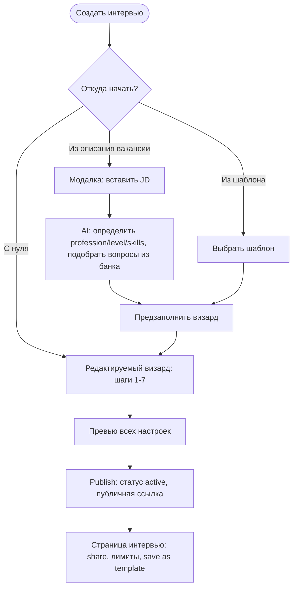
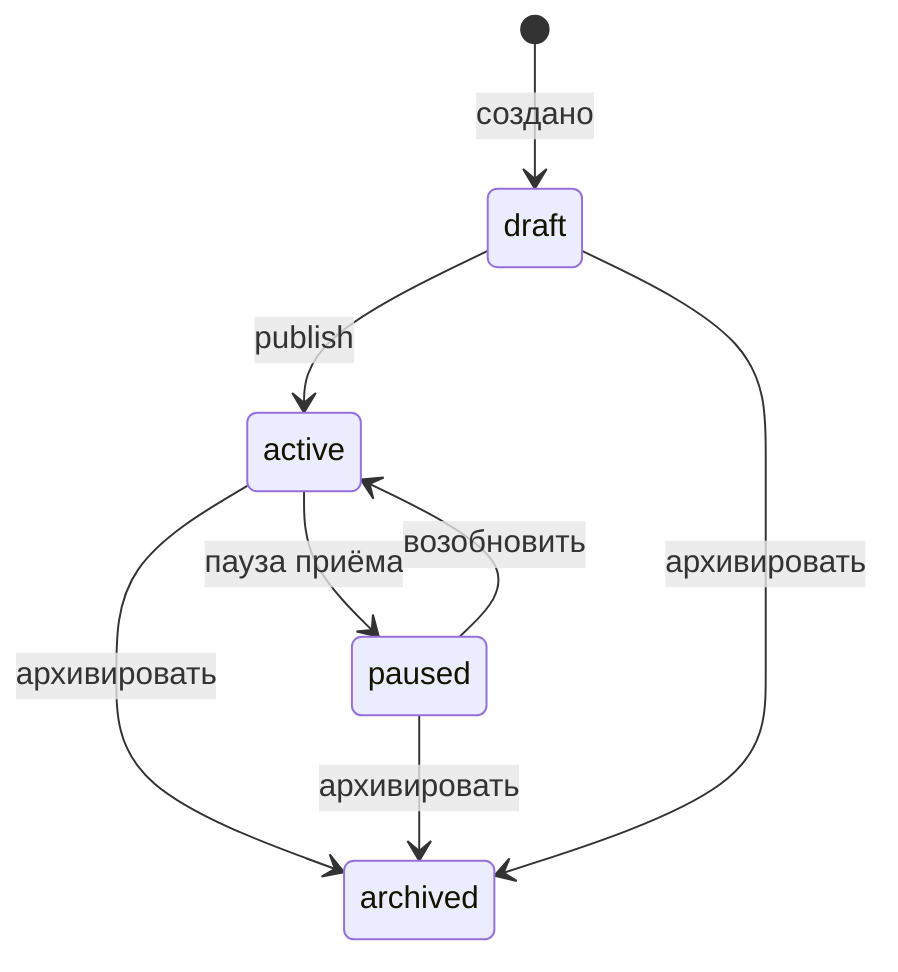

# Interview Creation Flow (Enhanced)

Design-doc для нового флоу создания интервью компанией: визард настройки + поведение AI-интервьюера + лимиты/дедлайны + lifecycle.

Цель: превратить «выбор вопросов» в полноценную настройку AI-интервьюера как «сотрудника» — с характером, глубиной, строгостью и рамками. Это ключевой дифференциатор продукта.

> Статус: design-doc (видение + модель данных + маппинг на код + roadmap). Код по этому документу пишется отдельными subtasks (см. раздел Roadmap).

---

## 1. Видение и принципы

- Компания настраивает AI-интервьюера как «сотрудника»: тон общения, глубину копания, строгость оценки и рамки прохождения.
- **Инвариант проекта (не нарушать):** тон / глубина / строгость меняют РАЗГОВОР и follow-up-бюджет, но НЕ меняют `max_score`, checkpoints и критерии оценки. Источник правды — банк вопросов.
- **Принцип «всё редактируемо до создания»:** любой быстрый старт (AI из JD, выбор шаблона) только ПРЕДЗАПОЛНЯЕТ визард. Пользователь всегда может изменить любое поле, добавить/убрать вопросы (хочет 10 — оставил, 3 — убрал) и докрутить настройки ПЕРЕД фактическим созданием интервью.
- **Шаблон — это НЕ готовое интервью, а сохранённый набор настроек** (вакансия + вопросы + поведение AI + лимиты). Выбор шаблона открывает тот же визард с предзаполненными, редактируемыми полями.

---

## 2. Точки входа

Три способа начать, но все ведут в ОДИН редактируемый визард (шаги 1–7). Отличается только степень предзаполнения.

- **С нуля** — пустой визард.
- **Из описания (JD)** — кнопка «Сгенерировать из описания» открывает модалку: пользователь вставляет текст вакансии → AI определяет profession / level / skills и подбирает вопросы из банка → результат предзаполняет визард → пользователь правит что угодно.
- **Из шаблона** — выбор шаблона предзаполняет визард его настройками → пользователь правит (убрать/добавить вопросы, сменить поля) → создаёт. Шаблон не создаёт интервью напрямую.

---

## 3. Визард настройки (шаги 1–7)

### Шаг 1 — Вакансия и контекст

- `title`, `jobRole`, `level`, `interviewLanguage`, `jobDescription`
- `profession` — выбор из справочника
- `skills` / stack — multi-select, показывать ТОЛЬКО скиллы, релевантные выбранной профессии
- сложность / уровень

### Шаг 2 — Подбор вопросов (отдельный «красивый» экран)

- Карточный/табличный список вопросов с понятными полями: текст вопроса, тема (`topic`), сложность (`difficulty`), уровень (`level`), score/вес (`max_score` + `interview_weight`).
- **Skills-first сортировка:** СНАЧАЛА вопросы и темы, связанные с выбранными на шаге 1 скиллами, потом остальные.
- Фильтры: тема, сложность, уровень, поиск.
- Кнопка **«Сгенерировать вопросы через AI»** = AI ПОДБИРАЕТ из нашего банка оптимальный набор под профессию/скиллы/уровень (ничего не выдумывает). Результат = преселекченные вопросы из банка, которые можно докрутить вручную.
- Ручная докрутка: add / remove / reorder, `questionCount`.

### Шаг 3 — Поведение AI-интервьюера

Три НЕЗАВИСИМЫЕ ручки + персона:

- **Тон общения (`ai_tone`):** `friendly` (подбадривает, снижает стресс) / `neutral` (ровно, по делу) / `strict` (challenging, стресс-интервью).
- **Глубина копания (`probing_depth`):** `shallow` (screening, минимум уточнений) / `balanced` (1–2 уточнения) / `deep` (дожимает до границ знаний).
- **Строгость оценки (`scoring_strictness`):** `lenient` / `balanced` / `strict` (влияет на пороги закрытия checkpoint, не на max score).
- **Персона:** `interviewer_name` + `welcome_message_template`.

### Шаг 4 — Формат и тайминги

- Режим: text / voice / video (`is_video_enabled` уже есть; голос/текст — расширение).
- `time_limit_minutes` — лимит на всё интервью.
- Что кандидат видит в конце: только «спасибо» или ещё и свой результат.

### Шаг 5 — Доступ и лимиты

- `expires_at` — дедлайн прохождения; после ссылка закрывается.
- `max_completions` — кап завершённых прохождений (защита от перегруза).
- `allow_retake` — одна попытка на email vs разрешить пересдачу.
- Обязательные поля кандидата (email всегда; phone/linkedin/github — опционально).

### Шаг 6 — Результаты и отбор

- `passing_score` — проходной порог; кандидаты ниже помечаются «не прошли».
- (опц.) авто-shortlist по порогу/категории.

### Шаг 7 — Превью и публикация

- Сводка всех настроек на одном экране.
- (Differentiator) «Попробовать как кандидат» — live preview в выбранном тоне/глубине/строгости.
- Publish → генерируется публичная ссылка, статус `active`.
- После создания (любым способом) — редирект на страницу интервью как единый центр управления.

---

## 4. Банк вопросов: что нужно добавить для шагов 1–2

Текущее состояние (по коду):

- Справочники `professions` / `skills` / `topics` глобальные, но отдельных GraphQL list-queries НЕТ (сейчас вытаскиваются клиентски из вложенных полей вопросов).
- Связь вопрос↔скилл: M2M `question_skills` + `topic.skill` + `questions.profession_id`. Отдельной таблицы `profession_skills` НЕТ.
- На бэке НЕТ фильтра по `skillId(s)` — есть `professionId`, `topicId`, `level`, `difficulty`, `search` (`backend/src/modules/question-bank/dto/question-filter.input.ts`).
- AI-подбора/генерации вопросов НЕТ.
- `QuestionPicker` не показывает score/вес; профессии/скиллы/темы отдельно на фронте не фетчатся.

Решения:

- **«Скиллы профессии» вычисляем из данных:** distinct skills у вопросов данной профессии (join `questions.profession_id` + `question_skills`). Рекомендуемый вариант — без нового справочника `profession_skills`. Альтернатива: отдельная таблица связей (отметить как опцию, если понадобится курирование).
- **Новые GraphQL queries:** `professions`, `skills(professionId?)`, `topics(skillId?/professionId?)` — для шага 1 и фильтров шага 2.
- **Фильтр `skillIds: [String!]`** в `QuestionBankFilterInput` (skills-first можно делать сортировкой на клиенте, но серверный фильтр/буст желателен).
- **AI-подбор** = новый backend-resolver: LLM ранжирует/отбирает вопросы, видимые компании (visibility policy `question-bank.schema.ts`), по profession/skills/level и возвращает `questionIds`. Соответствие принципу «банк = source of truth»: AI только отбирает существующие вопросы, не создаёт новые.

---

## 5. Модель данных (новые поля)

Решение: первоклассные, фильтруемые/энфорсимые поля — отдельными колонками. JSON `settings` — только для редких флагов.

Trade-off: отдельные колонки лучше для индексации/энфорса/типизации GraphQL; единый JSON-блоб гибче, но хуже для запросов и валидации. Рекомендация — колонки для всего, что энфорсится в рантайме (дедлайн, кап, пороги, поведение AI).

### Поведение AI — на `interviews` (+ зеркально на `interview_templates`)

- `ai_tone` ENUM('friendly','neutral','strict') DEFAULT 'neutral'
- `probing_depth` ENUM('shallow','balanced','deep') DEFAULT 'balanced'
- `scoring_strictness` ENUM('lenient','balanced','strict') DEFAULT 'balanced'

### Доступ / лимиты — на `interviews`

- `expires_at` DATETIME NULL (дедлайн; в шаблон НЕ кладём — это per-instance)
- `max_completions` INT UNSIGNED NULL (кап завершённых; в шаблон можно как дефолт)
- `allow_retake` TINYINT(1) DEFAULT 0
- `time_limit_minutes` INT UNSIGNED NULL
- `passing_score` DECIMAL(4,2) NULL
- обязательные поля кандидата: JSON `candidate_required_fields` ИЛИ булевы `require_phone` / `require_linkedin` / `require_github`

### Уже существует (переиспользуем)

- `interviews`: `interview_language`, `interviewer_name`, `welcome_message_template`, `is_video_enabled`, `question_count`, `status`, `public_token`, `level`, `job_role`, `profession_id`, `job_description`.
- `interview_templates`: те же поля, КРОМЕ `public_token` и без `draft` в статусе.

### Templates parity

Новые поля поведения AI (tone/depth/strictness), `time_limit_minutes`, `passing_score`, required-поля и (опц.) `max_completions` — добавить и в `interview_templates`. `expires_at` — НЕ добавляем (дедлайн всегда per-interview).

---

## 6. Lifecycle интервью

- Статусы: `draft` → `active` → (`paused`) → `archived`. Предлагается добавить `paused` (ручная пауза приёма).
- Вычисляемые состояния (не отдельный статус), проверяются на входе кандидата:
  - **expired** — `now > expires_at`
  - **full** — завершённых attempts `>= max_completions`
- **Единое правило редиректов:** после create (с нуля / из JD / из шаблона) → страница интервью (details) как единый центр управления: share-ссылка, статус, лимиты, publish/pause, save-as-template.

---

## 7. Маппинг на существующий код (reuse vs new)

Хорошая новость: движок уже умеет глубину и строгость — нужно прокинуть пресеты, а не строить с нуля.

### Tone (тон) — в основном новое

- Wire-in: `backend/src/modules/adaptive-interview/prompts/interviewer-voice.prompt.ts`, `prompts/follow-up-planner.prompt.ts` (`INTERVIEWER_PERSONA`), `prompts/main-question-opener.prompt.ts`, `prompts/main-question-reveal.prompt.ts`.
- Сейчас захардкожено «friendly professional». Нужен persona-пресет по `ai_tone`. `interviewer_name` можно добавить в opener/follow-up промпты (сейчас доходит только до welcome/TTS).

### Probing depth (глубина) — фундамент есть

- Пресет → override `getAdaptiveInterviewContextLimits()` в `adaptive-interview/config/adaptive-interview-context.config.ts`.
- Влияет на `follow-up-budget-allocator.util.ts` и early-stop в `follow-up-policy.util.ts`.
- Фундамент: weight-based budget (TASK-14.19), early stop (TASK-14.4), min probes before topic switch (TASK-14.26).

### Scoring strictness (строгость) — фундамент есть

- Пресет → варианты rubric в `prompts/per-turn-checkpoint-evaluation.prompt.ts` + множители в `apply-checkpoint-score-floors.util.ts` (`falseClaimCapFraction`, `positiveFloorScore`, shallow-accept fractions).

### Проброс конфигурации в движок — новое

- Расширить `AdaptiveInterviewContextPacket` и `AdaptiveInterviewContextService.buildContextPacket()` — подгружать строку `interviews` (сейчас interview-level поля в движок НЕ доходят, только snapshot вопросов).

### Создание — единая точка

- `InterviewCoreService.createInterview()` (`backend/src/modules/interview-core/`). Шаблоны и JD-флоу делегируют в неё. Расширить `CreateInterviewInput` новыми полями + маппер + репозиторий.

### Question bank (шаги 1–2) — новое

- List-queries professions/skills/topics: новый resolver в `backend/src/modules/question-bank/` (+ методы репозитория `findProfessions`, `findSkillsByProfession`, `findTopics`).
- Фильтр `skillIds` в `dto/question-filter.input.ts` + `buildFilterClause` в `question-bank.repository.ts` (join `question_skills`).
- AI-подбор: новый resolver/сервис.
- Frontend: новые RTK Query hooks (`useProfessionsQuery`, `useSkillsQuery`, `useTopicsQuery`) в `frontend/src/features/question-bank/api/questionBankApi.ts`; новый визард вместо `CreateInterviewPage` + `QuestionPicker` (показывать score/вес, skills-first через `groupQuestionsBySkill.ts`/новую логику).

### Enforcement лимитов — новое

- Проверка `expires_at` / `max_completions` / `allow_retake` на старте публичного интервью: `interview-public.service` и/или `findByPublicToken` (`interview-core`).

---

## 8. Differentiators («вау»-фичи)

Что делает интервью захватывающим для компаний. Для каждой: ценность, на что опираемся, место во флоу.

### Ближайший фокус

1. **JD → предзаполненный (редактируемый) визард** — кнопка «Сгенерировать из описания» → модалка → AI определяет profession/level/skills и подбирает вопросы из банка → предзаполняет визард (не создаёт интервью сразу), всё редактируемо. Опора: AI-подбор из банка (раздел 4). Принцип «банк = source of truth» сохраняется.
2. **«Попробовать как кандидат» (live preview)** — перед публикацией компания проходит своё интервью в выбранном tone/depth/strictness. Опора: существующий движок; нужен preview-режим attempt без записи в воронку кандидатов. Место: шаг 7.

### Следующий горизонт

3. **Сравнение кандидатов** — НЕ кросс-платформенный процентиль. Внутри интервью: список прошедших → выбрать 2 (попарно) или 3–4 → side-by-side (score, темы, сильные/слабые, рекомендация). Отдельный флоу на стороне результатов, НЕ часть создания. Опора: attempts + per-topic/per-checkpoint (блок 14).
4. **Skill-radar / тепловая карта** по темам кандидата. Опора: данные блока 14. Раздел отчёта.
5. **Брендированная страница кандидата** — лого/цвета/тёплое intro. Новые поля брендинга (company или interview) + публичная страница.

### Отложено

- **Детектор списывания / анти-чит** — осознанно отложен. В этом доке не раскрываем; вернёмся позже.

---

## 9. Roadmap (будущий блок 16, черновая разбивка)

Это roadmap, а не реализация в текущем проходе. Резать на subtasks отдельной командой, по одному.

1. Backend: list-queries professions / skills(by profession) / topics + frontend hooks.
2. Backend: фильтр `skillIds` в question bank + skills-first ordering.
3. Backend: AI-подбор вопросов из банка (resolver/сервис, возвращает `questionIds`).
4. DB-миграция: новые поля на `interviews` + `interview_templates`.
5. Backend: расширить `CreateInterviewInput` / типы / маппер / репозиторий.
6. Backend: проброс конфигурации в adaptive context packet.
7. Backend: tone preset в промпты.
8. Backend: probing depth preset → limits override.
9. Backend: strictness preset → rubric + guards.
10. Backend: enforcement лимитов на входе кандидата.
11. Frontend: визард (шаг 1 профессия/скиллы/уровень, шаг 2 подбор с AI-кнопкой, шаги 3–7) + превью.
12. Frontend: lifecycle/redirects + страница управления интервью.
13. Templates: parity новых полей + create-from-template с правкой полей.
14. Differentiators: JD→визард (модалка); live preview; (позже) сравнение кандидатов, skill-radar, брендинг.

---

## 9a. Frontend UI conventions

- Весь UI визарда/модалок/страницы управления — на **shadcn/ui** (`.cursor/rules/frontend-ui-shadcn.mdc`).
- Компоненты из `@shared/ui` (`frontend/src/shared/ui/`); недостающие ставить из папки `frontend/`: `pnpm dlx shadcn@latest add <component>`.
- Каталог компонентов: https://ui.shadcn.com/docs/components. Перед написанием нового UI свериться с каталогом.
- Иконки — `lucide-react`; стилизация — Tailwind + `cn` из `@shared/lib/utils`. Не вводить другие UI-киты и не дублировать существующие shadcn-компоненты.
- Полезные для этого флоу компоненты: tabs/stepper, card, select, multi-select (combobox/command), switch, radio-group, slider, date picker (calendar+popover), textarea, dialog/drawer, table/data-table, badge, tooltip, sonner (toasts).

## 10. Non-Goals (в этом проходе)

- Детектор списывания / proctoring (отложено по решению).
- Кросс-платформенный бенчмаркинг (заменён на сравнение кандидатов внутри интервью).
- AI-генерация НОВЫХ вопросов (только подбор из банка).
- Платежи, роли в команде, email-автоматизация (вне MVP по `docs/PROJECT.md`).

---

## Related

- `docs/PROJECT.md` (раздел 10 — основной flow; раздел 22 — главный принцип)
- `docs/interview-templates/README.md`
- `docs/database/schemas/interview-core.md`
- `docs/database/schemas/interview-templates.md`
- `docs/database/schemas/question-bank.md`
- `backend/src/modules/interview-core/`, `backend/src/modules/adaptive-interview/`, `backend/src/modules/question-bank/`
